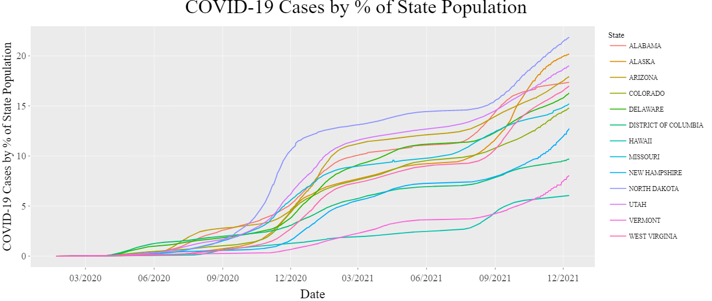
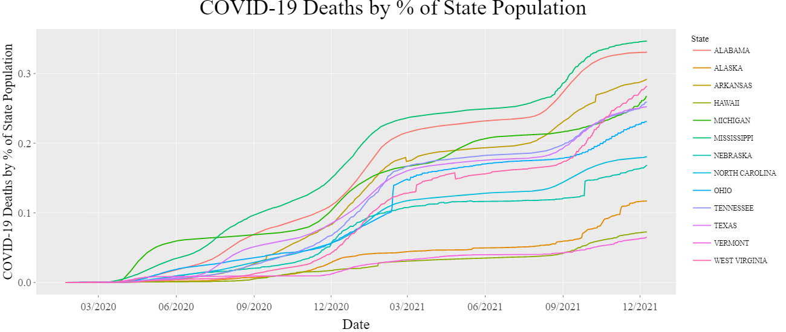

How has COVID-19 affected the US substance abuse crisis?
================
Chris Hanson
December 10, 2021

# Introduction

Drug overdose deaths in the United States have been rising steadily
since the turn of the century, and a significant increase in this trend
has been observed since the mid-2010’s. Public discourse around this
tragedy led to cultural and political changes which appeared to have
slowed the trend around 2018. Then, in March 2020, the COVID-19 pandemic
led to an upheaval in nearly every aspect of daily life, resulting in
drastic changes to the way we work, socialize, and interact with society
at large.

To slow the spread of the virus, most public gathering places were shut
down, leading to widespread loss of jobs and a crash of the economy.
Those with job security soon found new ways to work through the
pandemic, and those without it found themselves without a job and an
income.

There is good reason to expect that the devastation wrought by COVID-19
would lead to increasing deaths by overdose. Substance abuse is
associated with unemployment or underemployment, lack of career
opportunities, social isolation, mental health issues, and homelessness.
As COVID-19 has undeniably contributed to each of these factors, an
investigation into whether the pandemic has driven the increase in
overdose deaths is warranted.

# The COVID-19 pandemic in the US

COVID-19 was first detected in the USA on January 17, 2020, in
Washington State. By March 13, 2020, President Trump had declared a
nationwide emergency, and 2 days later, schools and restaurants began to
shut down. By May 9th, 2020, the unemployment rate hit 14.7%, the worst
rate since the Great Depression. By September 2020, the US COVID-19
death toll surpassed 200,000, and by January 18, 2021, it had doubled to
400,000. On December 14th, 2020, the initial phase of the vaccination
program began, and by March 13, 2021, the US had surpassed 100 million
vaccinations administered. By July 1st, 2021, the highly infectious
delta variant had become detected in all 50 US States.

There has been considerable difference between how each of the US States
has experienced COVID-19:

The state with the highest number deaths per population, MISSISSIPPI
(0.35%), has experienced per population mortality rates 5.34x higher
than that of the lowest number of deaths per population, VERMONT
(0.06%).

These differences are a result of a complicated web of interconnected
variables: geography, viral transmission tendencies, the extent to which
the state and local governments enforced lockdown measures, the culture
of the communities and how rigorously they practiced social distancing,
the types of economies typical of each region, and many more.

Having the above information in hand will help provide perspective as a
preliminary investigation into US drug useage patterns is explored.

# The drug overdose crisis in the US

The CDC offers a vast and thorough dataset providing monthly 12-month
rolling sums of overdose deaths by state, categorized by drug type
(heroin, cocaine, opioids, etc.) as well as drug type subcategories
(synthetic opioids, natural & semi-synthetic opioids, etc.).

Shown below is a plot of overdoses in the US from 2015-2021, broken down
by drug type and sub-type. Some of these are independent of all others:
Psychostimulants (methamphedamine) and cocaine have their own
categories. Others share data: there is one category for all opioids,
another for natural opioids, and another for synthetic opioids.

This plot immediately suggests some insights. For one, there does appear
to be a clear uptick in the rate of drug overdose deaths per year
following the onset of the COVID-19 pandemic. Also, it is the opioids
that are by far the most implicated drug, and it’s the synthetic, not
the natural opioids, that are the primary driver. Natural opioids are
those such as morphine and codeine; common semi-synthetic opioids are
hydrocodone and oxycodone.

According to numerous government agencies, the synthetic opioid behind
this great increase is fentanyl, which is often illicitly manufactured
and commonly used to lace other drugs. As little as two milligrams of
fentanyl can be lethal.

In January 2015 - the earliest data provided in this dataset - synthetic
opioids accounted for 12% of all overdose deaths. As of March 01, 2021 -
the most recent data provided in this dataset - synthetic opioids were
responsible for 64% of all drug overdose deaths in the US. During this
time, the total number of deaths due to synthetic opioids grew by 1081%.

Similar to the disparity in how each state experienced the COVID-19
pandemic, each state is experiencing the drug epidemic in its own way:

# How has COVID-19 affected the overdose crisis?

The reasons why states have historically experienced the drug overdose
epidemic so differently are numerous and complicated. In an effort to
strip away the noise of confounding variables and determine if there is
a true relationship with the COVID-19 pandemic, two different questions
are asked below:

Whether statewide *COVID-19 deaths* per capita is correlated with the
*percentage increase in deaths due to overdose* in a year, per capita.

Whether statewide *COVID-19 cases* per capita is correlated with
*non-normalized deaths due to overdose* per capita.

A visualization of the geographical distribution of these factors may
uncover some regional trends:

The maps highlight a few areas (the southeastern US) where COVID-19 and
deaths due to overdose seem to correlate, as well as contrasting areas
(the northern midwest, the New England area) where they seem inversely
related.

The scatter plots indicate that there is either no relation between the
two factors, or there is even a negative correlation.

While this may seem counterintuitive, COVID-19 affected the US in more
ways than just the mortalities from the virus itself. The economic
shutdown and enforced social distancing changed the way basic ways in
which our lives are lived, and these are the types of disruptions that
could lead to increased drug usage: social isolation, joblessness, and
the associated mental health effects. One conjecture which might explain
the negative correlation seen above is that those states which
experienced the lowest COVID-19 mortalities endured the most severe
lockdowns - resulting in lower virus associated deaths but higher social
isolation and a more damaged economy.

To investigate this possibility, another dataset will be introduced into
this analysis: monthly unemployment data in the 50 US states.

## COVID-19 associated unemployment and deaths by overdose

Upon realization of the severity of the pandemic spreading throughout
the country, a series of business shutdowns were enforced at each of the
county, state, and federal levels. Due to this patchwork approach to
shutdown laws as well as the unique nature of the economies of each
state, there was marked difference between the way each state
experienced unemployment and financial downturn. Hawaii and Nevada stand
out in particular, as tourism makes up a large sector of their
economies.

To examine the possibility that the unemployment experienced as a result
of the COVID-19 lockdowns led to increased drug usage and deaths by
overdose, below is a visualization of the relationship between these
factors.

(Hawaii is removed from these analyses as its economy is unusually
reliant on tourism and because it’s geographically isolated from the
mainland drug trade routes, making it an outlier.)

The plot of unemployment during the COVID-19 pandemic and overdose
deaths in Figure 11 suggested a relatively clear positive association
between the factors, but this relationship may be driven in part by pre
COVID-19 levels. It’s to be expected that a state with relatively high
drug usage rates would be experiencing increased unemployment.

When unemployment is normalized to pre COVID-19 levels in Figure 12, the
positive correlation is weakened but maintained.

Figure 13 is the most accurate portrayal of the real relationship
between COVID-19 unemployment and drug overdose deaths: The *relative
increase in the percent of the total state population that died due to
drug overdose* from the 12 months ending in April 2020 to the 12 months
ending in April 2021, compared to the *increase in the percent of the
state population experiencing unemployment* from February 2020, before
the pandemic, to October 2020, when unemployment began to recede in most
states. A positive correlation is suggested, but not certain.

## COVID-19 associated economic slowdown and deaths by overdose

Another way to measure the economic health of a community is to consider
the change in state GDP in the period following the COVID lockdown.

(This data is provided quarterly, and the shutdown occurred part way
through the 1st quarter of 2020, which is represented by the point at
2020-01-01.)

To adjust for the magnitude of difference between the size of each
state’s economy, GDP values are normalized to pre-pandemic levels:

Finally, to examine whether the degree of economic slowdown suffered in
each US state correlates with deaths due to drug overdose, this data is
plotted together:

While the above plot shows considerable variance in the relationship
between the factors, a positive correlation does appear to exist.

# Conclusion and Summary

The intent of this project was to use publicly available datasets to
investigate whether the COVID-19 pandemic had a discernible effect on
the drug overdose epidemic which is currently devastating communities
across the US. As these crises both affect and are affected by the
common circumstances of daily life - employment, health, mental
wellbeing - the question of whether they are directly influencing each
other is a natural one.

Across the entire US, deaths due to drug overdose have been on the rise
for decades. The substances of bygone days - heroin and methamphetamine
- are less implicated lately than are drugs of the opioid class. The
rise of opioid addiction in the US has been linked to a an increase in
the legal pharmaceutical prescription of opioids by a medical community
which perhaps misunderstood the addictive nature of the substance. Once
legal prescriptions expired, many patients in withdrawal found
themselves turning to illicitly manufactured street drugs as a
replacement. These drugs are irregular in dosage and are often cut with
various other substances, making their use very risky. Fatal overdoses
are increasingly attributed to opioids cut with fentanyl, which is
incredibly potent in even tiny amounts, making it ideal for smuggling
and extremely dangerous to ingest. As public understanding of the
situation grew, governmental regulations and a change in the behavior of
the medical community began making inroads on curtailing the crisis.
However, upon onset of the COVID-19 pandemic, the substance abuse crisis
appeared to begin accelerating again. Whether the pandemic is itself to
blame or why it might have this effect is not immediately understood,
making this a worthy investigation.

An initial exploration of the available data made it clear that
deciphering concrete truths about cause-and-effect relationships between
any individual indicators would be difficult. Even small communities in
this country are culturally heterogeneous, and geographically adjacent
communities may have very distinct, contrasting identities. As such,
attempting to find trends shared across entire states is a process
fraught with noise and irregularity, where any clear conclusion drawn
will be called into question with even a slight change in the underlying
assumptions. This project has been an attempt to sift through the
available datasets and detect incontrovertible relationships between the
indicators in question – COVID-19 cases and associated deaths, the
economic fallout from COVID-19, and deaths due to drug overdose.
Ultimately, the analyses performed did suggest correlations between
these variables, but were not indisputable beyond a doubt.

# Methods

Data for the population of the US and its States was collected from the
census.gov’s API portal. It was converted to a data.table by the methods
instructed in lecture, and associated with other data.tables using the
data.table merge method. The COVID-19 data was accessed via the
data.cdc.gov API portal. It was merged with census data to calculate
COVID-19 infections and deaths as a percentage of the state population.
Data for drug overdoses in the USA was also accessed through the
data.cdc.gov API. It was merged with the census data to be able to
calculate overdose percentages by state population. Later, it was merged
with the COVID-19 data to investigate the relationship between overdoses
and COVID-19 infection rates. Data for unemployment was downloaded from
the Bureau of Labor Statistics website. Data for GDP was received from
the Bureau of Economic Analysis API. The data was very reliable, as it
was thoroughly gathered by the CDC and other reliable governmental
agencies, and needed very little cleaning or wrangling. Data exploration
was mainly done visually using ggplot2 line and scatterplots.

# Sources

<https://www.cdc.gov/museum/timeline/covid19.html>

<https://www.cdc.gov/drugoverdose/deaths/synthetic/index.html>

<https://www.hhs.gov/opioids/about-the-epidemic/index.html>

<https://www.cdc.gov/museum/timeline/covid19.html>

<https://data.cdc.gov/NCHS/VSRR-Provisional-Drug-Overdose-Death-Counts/xkb8-kh2a>

<https://apps.bea.gov/api/_pdf/bea_web_service_api_user_guide.pdf>

<https://www.bls.gov/lau/data.htm>
